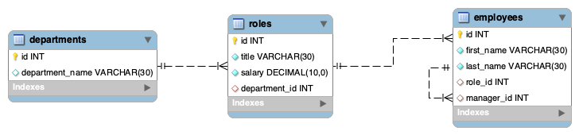
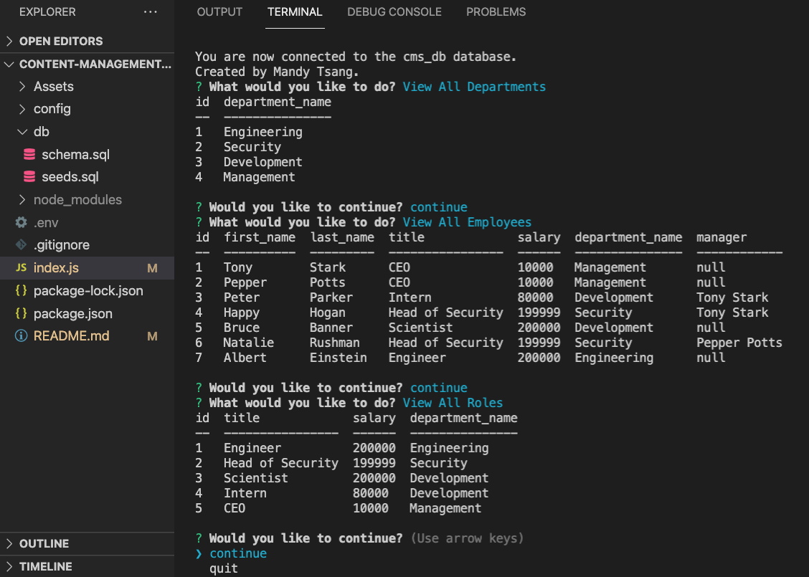
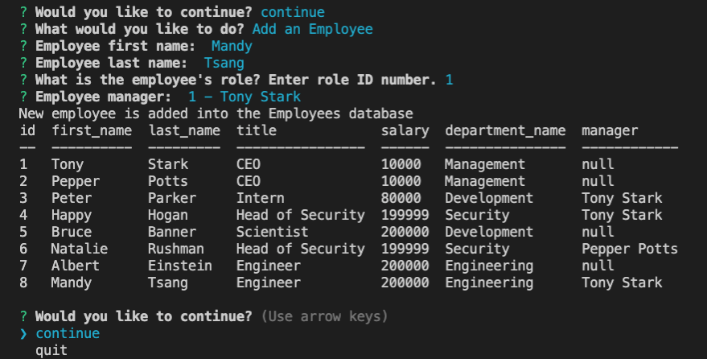

# content-management-system
[](https://opensource.org/licenses/MIT)


The Content Management System (CMS) is a command-line application I have built from scratch using Node.js, Inquirer, and MySQL. It is a tool to manage a company's employee database. The application allows the user to add, delete, and update employee records, as well as view and manage the departments, roles, and employees information in a company in a variety of ways.

## Table of Contents

- [Installation](#installation)
- [Usage](#usage)
- [Built with](#built-with)
- [Development Process](#development-process)
- [Future Development](#future-development)
- [Author](#author)
- [License](#license)

## Installation

1. Clone from the repository.
2. Install Node.js and npm if you haven't already done so.
3. Navigate to the project directory in your terminal and run `npm install` to install the required dependencies.
4. Create .env file at root directory, change values as needed (for use with MySQL database):
```
DB_PASSWORD='your_password'
DB_HOST='localhost'
DB_USER='root'
DB_NAME='cms_db'
```

## Usage

1. Navigate to the db directory where the database seeding script is located.
2. Run the following command to connect to the database using the command line:
```
mysql -u root -p
```
3. Enter your MySQL password when prompted.
4. Once connected to the database, run the following command to execute the SQL script and seed the database with data:
```
source schema.sql
source seeds.sql
```
5. Return to the root directory, open the terminal and run `npm start`.


## Built With

* [Node.js](https://nodejs.org/en/)
* [Inquirer](https://www.npmjs.com/package/inquirer)
* [MySQL](https://www.npmjs.com/package/mysql2)
* [DotEnv](https://www.npmjs.com/package/dotenv)
* [Console-Table](https://www.npmjs.com/package/console.table)

## Development Process

Below is the design of the ERD (entity relationship diagram). It consists of three entities, with relationships between the roles and departments entities, and between the employees and roles entities as well as between the employees and itself.
.

In the schema, the ON DELETE CASCADE constraint is added to the relationship between the roles and departments entities, which ensures that if a department is deleted, all the roles associated with that department are also deleted. Please note that this CMS program is for demo purpose only, the use of ON DELETE CASCADE should be used carefully as it will automatically delete related rows in child tables when a row in the parent table is deleted. 

Here are some screenshot demonstrations:



## Future Development

* Confirmation on Update / Delete
* Return to Previous Menu option
* Delete roles and employees
* Create ON DELETE CASCADE alternative

## Author

Mandy Tsang is the author of this application. Find additional work on Mandy Tsang's [Github profile.](https://github.com/MANDYTSANG007).

## License

This project is licensed under the MIT License - see [MIT](https://opensource.org/licenses/MIT)
[](https://opensource.org/licenses/MIT)


